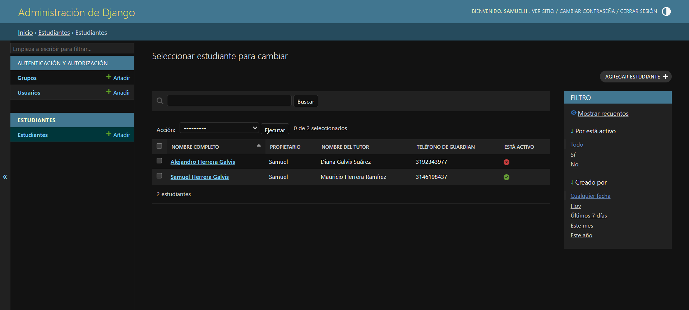
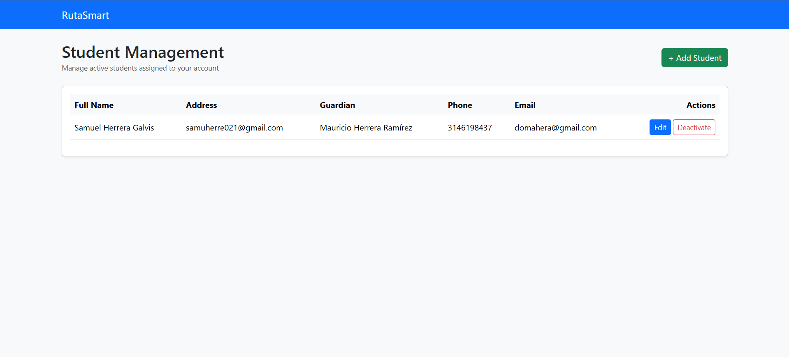

# Workshop 2 – Implemented User Story

## Selected User Story
**HU-004 – Student Management**

**Connextra:**  
As a driver, I want to register and manage students, so that I can keep the passenger information for my route up to date.

**Acceptance Criteria (Gherkin):**

**Scenario 1**  
**Given that** the driver is authenticated,  
**When** they register a student with a valid name, address, and guardian contact information,  
**Then** the system shall store the student in the database.

**Scenario 2**  
**Given that** a student is already registered,  
**When** the driver modifies the student’s information,  
**Then** the system shall update the record correctly.

**Scenario 3**  
**Given that** the driver has registered students,  
**When** they mark one of them as inactive,  
**Then** the system shall change the student’s status and exclude them from the list of active students.

## **Evidencies**

### **Views of Admin**

### **Views of Conductor**

